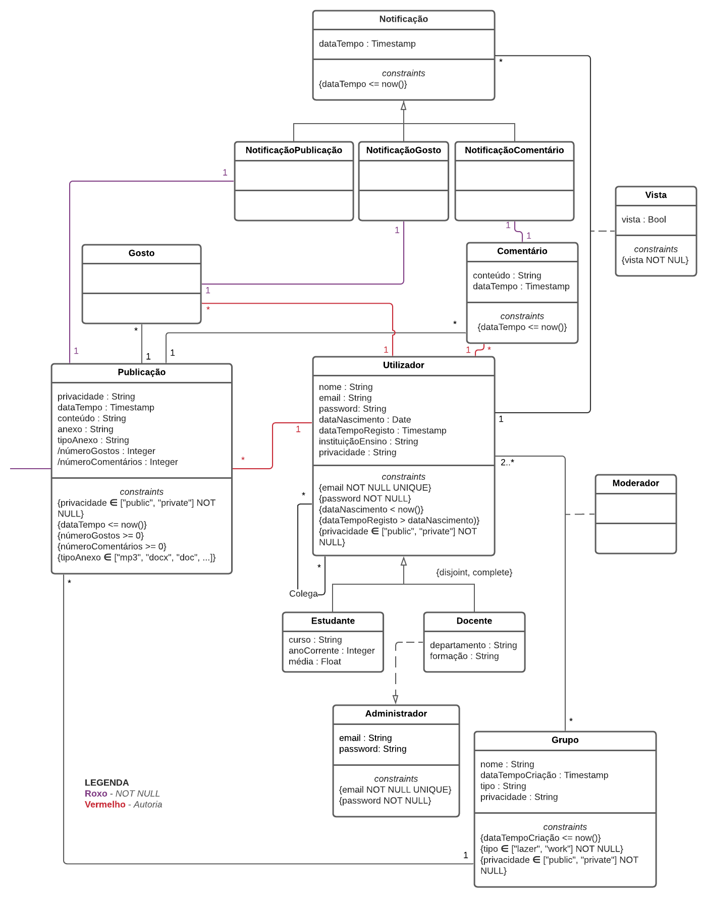

# EBD - Especificação da Base de Dados

28 de novembro de 2021

## Tema Geral

Social Networks

## **Autores**

Cristina Pêra (up201907321)

Luís Soares (up201406356)

Mateus Silva (up201906232)

Melissa Silva (up201905076)

## A4: Modelo Conceptual de Dados <sup>[1.1-1.2]</sup>

Esta componente visa a modelação inicial do sistema a utilizar para a base de dados da plataforma em desenvolvimento, procurando conceptualizá-la por meio de classes, os seus respetivos atributos e as suas interconexões.

### Modelo UML <sup>[2.1-2.6, 3.1-3.4, 4.1-4.8]</sup>



### Restrições Adicionais

1. Os atributos ***númeroGostos*** e ***númeroComentários*** são derivados e implementados a partir de gatilhos/*triggers*.
2. Haverá 2 moderadores para cada grupo, sendo que em grupos de tipo "work", um moderador será utilizadorEstudante e o outro utilizadorDocente e nos grupos de tipo "lazer", esses 2 moderadores podem ser qualquer combinação de utilizadores.

## A5: Esquema Relacional, Validação e Refinamento do Esquema

Esta componente visa a elaboração de um esquema relacional partindo do *UML* da componente **A4**, a sua subsequente validação e, se necessário, a sua normalização.

### Esquema Relacional

| Código da Relação |                          Cabeçalho                           |
| :---------------: | :----------------------------------------------------------: |
|        R01        | utilizador(<ins>id</ins>, nome, email **UK** **NN**, password **NN**, dataNascimento **CK** dataNascimento < now(),<br />dataTempoRegisto **CK** dataTempoRegisto > dataNascimento, instituiçãoEnsino, <br />privacidade **NN CK** privacidade **IN** PRIVACIDADE, fotoPerfil, is_blocked, fotoHeader) |
|        R02        | utilizadorEstudante(<ins>id </ins>-> utilizador.id, curso, anoCorrente, média) |
|        R03        | utilizadorDocente(<ins>id </ins>-> utilizador.id, departamento, formação) |
|        R04        | moderador(<ins>idGrupo</ins> -> grupo.id, <ins>idUtilizador </ins>-> utilizador.id) |
|        R05        | administrador(<ins>id</ins>, email **UK** **NN**, password **NN**, idDocente->utilizadorDocente.id) |
|        R06        | grupo(<ins>id</ins>, nome, dataTempoCriação **CK** dataTempoCriação ≤ now(), tipo **NN CK** tipo **IN** TIPO_GRUPO, privacidade **NN CK** privacidade **IN** PRIVACIDADE) |
|        R07        | grupoUtilizador(<ins>idGrupo</ins> -> grupo.id **NN**, <ins>idUtilizador</ins> -> utilizador.id **NN**) |
|        R08        | notificação(<ins>id</ins>, tipo **NN** **CK** tipo in TIPO_NOTIFICAÇÃO, dataTempo **CK** (dataTempo ≤ now())) |
|        R09        | gosto(<ins>id</ins>, idNotificação -> notificação.id,<br />idUtilizador -> utilizador.id, idPublicação -> publicação.id) |
|        R10        | publicação(<ins>id</ins>, idNotificação -> notificação.id, privacidade **NN** **CK** privacidade **IN** PRIVACIDADE,<br />dataTempo **CK** dataTempo ≤ now(), númeroGostos **CK** númeroGostos >= 0, númeroComentários **CK** númeroComentários >= 0, conteúdo, anexo, tipoAnexo **CK** tipoAnexo IN TIPOS_ANEXO, idUtilizador->utilizador.id) |
|        R11        | comentário(<ins>id</ins>, dataTempo **CK** dataTempo ≤ now(),<br />idNotificação -> notificação.id, idUtilizador -> utilizador.id,<br />idPublicação -> publicação.id, conteúdo) |
|        R12        | notificaçãoUtilizador(<ins>id</ins>,idNotificação-> notificação.id,<br />idUtilizador -> utilizador.id, vista **NN**)<br/>**UK**(idNotificação, idUtilizador) |
|        R13        | grupoPublicação(idGrupo -> grupo.id, <ins>idPublicação</ins>->publicação.id) |
|        R14        | colega(<ins>colega1</ins>->utilizador.id, <ins>colega2</ins>->utilizador.id) |

**Legenda**

- UK = UNIQUE KEY;
- NN = NOT NULL;
- CK = CHECK;
- DF = DEFAULT;

**Domínios**

| ETIQUETA         | VALORES                           |
| ---------------- | --------------------------------- |
| PRIVACIDADE      | ENUM ('public', 'private')        |
| TIPO_GRUPO       | ENUM ('lazer', 'work')            |
| TIPO_NOTIFICAÇÃO | ENUM ('like', 'comment', 'post')  |
| TIPO_ANEXO       | ENUM ('mp3', 'photo', 'document') |

### **Validação do Esquema**

Procederemos, então, à validação do esquema através do estudo das suas dependências funcionais, além de verificarmos, também através destas, se as nossas relações se encontram na *Forma Normal de Boyce-Codd* (BCNF).

| **Tabela R01** (utilizador)                                  |
| ------------------------------------------------------------ |
| **Chaves**: {id}                                             |
| **Dependências Funcionais**                                  |
| FD0101 {id} -> {nome, email, password, dataNascimento, dataTempoRegisto, instituiçãoEnsino, privacidade, fotoPerfil, is_blocked, fotoHeader} |
| **Forma Normal**: BCNF                                       |

| **Tabela R02** (utilizadorEstudante)       |
| ------------------------------------------ |
| **Chaves**: {id}                           |
| **Dependências Funcionais**                |
| FD0201 {id} -> {curso, anoCorrente, média} |
| **Forma Normal**: BCNF                     |

| Tabela R03 (utilizadorDocente)          |
| --------------------------------------- |
| **Chaves**: {id}                        |
| **Dependências Funcionais**             |
| FD0301 {id} -> {departamento, formação} |
| **Forma Normal**: BCNF                  |

| Tabela R04 (moderador) |
| -------------------------------- |
| **Chaves**: {idGrupo, idUtilizador}                 |
| **Dependências Funcionais**      |
| Sem dependências funcionais não triviais. |
| **Forma Normal**: BCNF           |

| Tabela R05 (administrador)                  |
| ------------------------------------------- |
| **Chaves**: {id}                            |
| **Dependências Funcionais**                 |
| FD0501 {id} -> {email, password, idDocente} |
| **Forma Normal**: BCNF                      |

| Tabela R06 (grupo)                                           |
| ------------------------------------------------------------ |
| **Chaves**: {id}                                             |
| **Dependências Funcionais**                                  |
| FD0601 {id} -> {nome, dataTempoCriação, tipo, privacidade} |
| **Forma Normal**: BCNF                                       |

| Tabela R07 (grupoUtilizador)               |
| ------------------------------------------ |
| **Chaves**: {idGrupo, idUtilizador}        |
| **Dependências Funcionais**                |
| Sem dependênciais funcionais não triviais. |
| **Forma Normal**: BCNF                     |

| Tabela R08 (notificação)             |
| ------------------------------------ |
| **Chaves**: {id}                     |
| **Dependências Funcionais**          |
| FD0801 {id}->{tipo, dataTempo} |
| **Forma Normal**: BCNF               |

| Tabela R09 (gosto)          |
| --------------------------- |
| **Chaves**: {id}            |
| **Dependências Funcionais** |
| FD0901 {id}->{idNotificação, idUtilizador, idPublicação}       |
| **Forma Normal**: BCNF      |

| Tabela R10 (publicação)                                      |
| ------------------------------------------------------------ |
| **Chaves**: {id}                                             |
| **Dependências Funcionais**                                  |
| FD1001 {id}->{idNotificação, privacidade, dataTempo, númeroGostos, númeroComentários, conteúdo, anexo, tipoAnexo, idUtilizador} 
| **Forma Normal**: BCNF                                       |

| Tabela R11 (comentário)                                      |
| ------------------------------------------------------------ |
| **Chaves**: {id}                                             |
| **Dependências Funcionais**                                  |
| FD1101 {id} -> {dataTempo, idNotificação, idUtilizador, idPublicação, conteúdo} |
| **Forma Normal**: BCNF                                       |

| Tabela R12 (notificaçãoUtilizador)               |
| ------------------------------------------------ |
| **Chaves**: {id}                                 |
| **Dependências Funcionais**                      |
| F1201 {id}->{idUtilizador, idNotificação, vista} |
| **Forma Normal**: BCNF                           |

| Tabela R13 (grupoPublicação)    |
| ------------------------------- |
| **Chaves**: {idPublicação}      |
| **Dependências Funcionais**     |
| F1301 {idPublicação}->{idGrupo} |
| **Forma Normal**: BCNF          |

| Tabela R14 (colega) |
| -------------------------------- |
| **Chaves**: {colega1, colega2}        |
| **Dependências Funcionais**      |
| Sem dependênciais funcionais não triviais. |
| **Forma Normal**: BCNF           |


Visto todas as relações se encontrarem na *Forma Normal de Boyce-Codd* (BCNF), podemos dizer que o esquema se encontra, também, em *BCNF*, pelo que não precisa de ser normalizado.

## A6: Índices, *Triggers* e População da Base de Dados

### Carga de Trabalho (*Workload*)

| **Relação** |     Nome da Relação     | Ordem de Magnitude | Crescimento Esperado |
| :---------: | :---------------------: | :----------------: | :------------------: |
|     R01     |      *utilizador*       |   12m (milhares)   |       1.2m/ano       |
|     R02     |  *utilizadorEstudante*  |        10m         |       1.2m/ano       |
|     R03     |   *utilizadorDocente*   |         2m         |       100/ano        |
|     R04     |       *moderador*       |         5m         |        1m/ano        |
|     R05     |     *administrador*     |        0.1m        |        10/ano        |
|     R06     |         *grupo*         |        2.5m        |       500/ano        |
|     R07     |    *grupoUtilizador*    |        25m         |       2.5m/ano       |
|     R08     |      *notificação*      |   22M (milhões)    |       5.5m/dia       |
|     R09     |         *gosto*         |        600m        |        2m/dia        |
|     R10     |      *publicação*       |        60m         |       100/dia        |
|     R11     |      *comentário*       |         1M         |       2.5m/dia       |
|     R12     | *notificaçãoUtilizador* |       1.66M        |       4.6m/dia       |
|     R13     |    *grupoPublicação*    |        42m         |        70/dia        |
|     R14     |        *colega*         |        2.4m        |       100/ano        |

### Índices Propostos

Para a melhoria da performance da base de dados associada ao nosso modelo relacional, propomos os índices seguintes. Possuímos três índices de perfomance e três do tipo *full-text search*.

#### Índices de *Performance*

| **Índice**             | *IDX01*                                                      |
| ---------------------- | ------------------------------------------------------------ |
| **Relações do Índice** | *publicação*                                                 |
| **Atributo Indexado**  | *privacidade*                                                |
| **Tipo do Índice**     | B-Tree                                                       |
| **Cardinalidade**      | Baixa                                                        |
| **Clustering**         | Não                                                          |
| **Justificação**       | A exibição de um perfil é uma ação frequente e que requer a busca de todas as publicações públicas de um utilizador. Portanto, criámos um índice onde filtramos as publicações pelo atributo *privacidade*, de modo a tornar a busca por publicações públicas mais rápida. Apesar de se tratar de uma ação de filtragem, não é possível usar aqui o hash devido ao atributo *privacidade* só ter dois valores possíveis: *public* e *private*, não havendo assim a distinção necessária para fazer uma função de hash. |
| **Código SQL**         | CREATE INDEX public_posts  ON publicacao(privacidade)  WHERE privacidade = 'public'; |

| **Índice**             | IDX02                                                        |
| ---------------------- | ------------------------------------------------------------ |
| **Relações do Índice** | *grupoPublicação*                                            |
| **Atributo Indexado**  | *idGrupo*                                                    |
| **Tipo do Índice**     | B-Tree                                                       |
| **Cardinalidade**      | Alta                                                         |
| **Clustering**         | Sim                                                          |
| **Justificação**       | A exibição das publicações de um grupo é uma ação frequente e que requer a busca de todas as publicações associadas a ele. Portanto, criámos um índice onde filtramos as publicações feitas em todos os grupos existentes pelo atributo *idGrupo*, de modo a tornar a busca por publicações num dado grupo mais rápida. É uma ação frequente e o número de dados nas tabelas irá aumentar com uma frequência moderada, logo é necessário usar B-Tree, pela sua eficiência e maior capacidade de lidar com o crescimento dos dados. |
| **Código SQL**         | CREATE INDEX group_posts  ON grupoPublicacao  USING btree (idGrupo); |

| **Índice**             | IDX03                                                        |
| ---------------------- | ------------------------------------------------------------ |
| **Relações do Índice** | *publicação*                                                 |
| **Atributo Indexado**  | *idUtilizador*                                               |
| **Tipo do Índice**     | B-Tree                                                       |
| **Cardinalidade**      | Alta                                                         |
| **Clustering**         | Sim                                                          |
| **Justificação**       | A exibição das publicações de um utilizador é uma ação frequente e que requer a busca de todas as publicações associadas a ele. Portanto, criámos um índice onde filtramos as publicações pelo atributo *idUtilizador*, de modo a tornar a busca por publicações de um dado utilizador mais rápida.  É uma ação frequente e o número de dados nas tabelas irá aumentar com uma frequência moderada, sendo necessário usar B-Tree, pela sua eficiência e maior capacidade de lidar com o crescimento dos dados. |
| **Código SQL**         | CREATE INDEX user_posts ON publicacao  USING btree (idUtilizador); |

#### Índices do tipo *full-text search*

| **Índice**             | IDX11                                                        |
| ---------------------- | ------------------------------------------------------------ |
| **Relações do Índice** | *utilizador*                                                 |
| **Atributo Indexado**  | *nome*                                                       |
| **Tipo do Índice**     | GIN                                                          |
| **Clustering**         | Não                                                          |
| **Justificação**       | Proporciona funcionalidades *full-text search* para procurar por utilizadores usando o seu nome. O tipo de índice é GIN porque não se espera que o atributo indexado mude com frequência. |
| **Código SQL**         | ALTER TABLE utilizador<br/>ADD COLUMN tsvectors TSVECTOR;<br/><br/>CREATE FUNCTION utilizador_search_update()<br/>RETURNS TRIGGER AS $$<br/>BEGIN <br/> IF TG_OP = 'INSERT' THEN <br/>      NEW.tsvectors = (setweight(to_tsvector('portuguese',NEW.nome),'A'));<br/> END IF;<br/> IF TG_OP = 'UPDATE' THEN <br/>          IF (NEW.nome <> OLD.nome) THEN <br/>               NEW.tsvectors = (setweight(to_tsvector('portuguese',NEW.nome),'A'));<br/>          END IF;<br/> END IF;<br/> RETURN NEW;<br/>END;<br/> $$<br/>LANGUAGE plpgsql;<br/><br/>CREATE TRIGGER utilizador_search_update<br/>  BEFORE INSERT OR UPDATE ON utilizador<br/>  FOR EACH ROW <br/>  EXECUTE PROCEDURE utilizador_search_update();<br/><br/>CREATE INDEX search_user <br/>ON utilizador<br/>USING GIN(tsvectors); |

| **Índice**             | IDX12                                                        |
| ---------------------- | ------------------------------------------------------------ |
| **Relações do Índice** | *grupo*                                                      |
| **Atributo Indexado**  | *nome*                                                       |
| **Tipo do Índice**     | GIN                                                          |
| **Clustering**         | Não                                                          |
| **Justificação**       | Proporciona funcionalidades *full-text search* para procurar por grupos usando o seu nome. O tipo de índice é GIN porque não se espera que o atributo indexado mude com frequência. |
| **Código SQL**         | ALTER TABLE grupo<br/>ADD COLUMN tsvectors TSVECTOR;<br/><br/>CREATE FUNCTION grupo_search_update()<br/>RETURNS TRIGGER AS $$<br/>BEGIN <br/> IF TG_OP = 'INSERT' THEN NEW.tsvectors = (setweight(to_tsvector('portuguese',NEW.nome),'A'));<br/> END IF;<br/><br/> IF TG_OP = 'UPDATE' THEN <br/>          IF (NEW.nome <> OLD.nome) THEN <br/>                         NEW.tsvectors = (setweight(to_tsvector('portuguese',NEW.nome),'A'));<br/>          END IF;<br/> END IF;<br/> RETURN NEW;<br/>END;<br/> $$<br/>LANGUAGE plpgsql;<br/><br/>CREATE TRIGGER grupo_search_update<br/>  BEFORE INSERT OR UPDATE ON grupo<br/>  FOR EACH ROW <br/>  EXECUTE PROCEDURE grupo_search_update();<br/><br/>CREATE INDEX search_group <br/>ON grupo <br/>USING GIN(tsvectors); |

| **Índice**             | IDX13                                                        |
| ---------------------- | ------------------------------------------------------------ |
| **Relações do Índice** | *publicação*                                                 |
| **Atributo Indexado**  | *conteúdo*                                                   |
| **Tipo do Índice**     | GiST                                                         |
| **Clustering**         | Não                                                          |
| **Justificação**       | Proporciona funcionalidades *full-text search* para procurar por publicações usando o seu conteúdo (termos incluídos neste). O tipo de índice é GiST porque espera-se que os atributos indexados mudem com frequência, pois a tabela *publicação* recebe novas adições frequentemente. |
| **Código SQL**         | ALTER TABLE publicacao<br/>ADD COLUMN tsvectors TSVECTOR;<br/><br/>CREATE FUNCTION post_search_update()<br/>RETURNS TRIGGER AS $$<br/>BEGIN <br/> IF TG_OP = 'INSERT' THEN NEW.tsvectors = setweight(to_tsvector('portuguese',NEW.conteudo),'A')); <br/>END IF; <br/> IF TG_OP = 'UPDATE' THEN <br/>          IF (NEW.conteudo <> OLD.conteudo) THEN <br/>                       NEW.tsvectors = (setweight(to_tsvector('portuguese',NEW.conteudo),'A'));<br/>          END IF;<br/> END IF;<br/> RETURN NEW;<br/>END;<br/> $$<br/>LANGUAGE plpgsql;<br/><br/>CREATE TRIGGER post_search_update<br/>  BEFORE INSERT OR UPDATE ON publicacao<br/>  FOR EACH ROW <br/>  EXECUTE PROCEDURE post_search_update();<br/><br/>CREATE INDEX search_post<br/> ON publicacao<br/> USING GiST(tsvectors); |

### *Triggers*

| *Trigger*      | TRIGGER01                                                    |
| -------------- | ------------------------------------------------------------ |
| **Descrição**  | Cada vez que um utilizador gosta de uma publicação, o valor no atributo *númeroGostos* da sua entrada deve ser incrementado. Este trigger serve para implementar uma das **Restrições Adicionais** que não eram possíveis de representar no UML. |
| **Código SQL** | CREATE FUNCTION num_likes() <br/>RETURNS TRIGGER AS <br/>$$ <br/>BEGIN<br/>         UPDATE publicacao<br/>         SET<br/>             númeroGostos = IFNULL(númeroGostos, 0) + 1<br/>         WHERE id = new.publicacao;<br/>END $$ <br/>LANGUAGE plpgsql;<br/><br/>CREATE TRIGGER num_likes <br/>               AFTER INSERT ON gosto<br/>               FOR EACH ROW<br/>               EXECUTE PROCEDURE num_likes(); |

| *Trigger*      | TRIGGER02                                                    |
| -------------- | ------------------------------------------------------------ |
| **Descrição**  | Cada vez que um utilizador comenta numa publicação, o atributo *númeroComentários* desta deve ser incrementado. Este trigger serve para implementar uma das **Restrições Adicionais** que não eram possíveis de representar no UML. |
| **Código SQL** | CREATE FUNCTION num_comments()<br/>RETURNS TRIGGER AS <br/>$$ <br/>BEGIN<br/>         UPDATE publicacao<br/>          SET<br/>             númeroComentários = IFNULL(númeroComentários, 0) + 1<br/>         WHERE id = new.publicacao;<br/>END;<br/>$$<br/>LANGUAGE plpgsql;<br/><br/>CREATE TRIGGER num_comments <br/>               AFTER INSERT ON comentário<br/>               FOR EACH ROW<br/>               EXECUTE PROCEDURE num_comments(); |

| *Trigger*      | TRIGGER03                                                    |
| -------------- | ------------------------------------------------------------ |
| **Descrição**  | Cada vez que um utilizador comenta numa publicação, deve gerar uma notificação do tipo comentário para o dono da publicação na qual comentou. |
| **Código SQL** | CREATE FUNCTION not_comments()<br/>RETURNS TRIGGER AS <br/>$$ <br/>DECLARE<br/>          n_id integer;<br/>          id_u integer;<br/>        <br/>BEGIN<br/>          INSERT INTO notificacao(tipo, dataTempo) values('comment',now()) RETURNING id INTO n_id;<br/><br/>          SELECT idUtilizador <br/>          INTO id_u<br/>          FROM publicacao <br/>          WHERE id = NEW.idPublicacao;<br/><br/>           INSERT INTO notificacaoUtilizador(idNotificacao, idUtilizador) values (n_id, id_u);<br/>           RETURN NEW;<br/>END;<br/>$$<br/>LANGUAGE plpgsql;<br/><br/>CREATE TRIGGER not_comments <br/>               AFTER INSERT  ON comentário<br/>               FOR EACH ROW<br/>               EXECUTE PROCEDURE not_comments(); |

| *Trigger*      | TRIGGER04                                                    |
| -------------- | ------------------------------------------------------------ |
| **Descrição**  | Cada vez que um utilizador gosta de uma publicação,deve gerar uma notificação do tipo gosto para o dono da publicação da qual gostou. |
| **Código SQL** | CREATE FUNCTION not_likes()<br/>RETURNS TRIGGER AS <br/>$$ <br/>DECLARE<br/>          n_id integer;<br/>          id_u integer;<br/><br/>BEGIN<br/>          INSERT INTO notificacao(tipo, dataTempo) values('like',now()) RETURNING id INTO n_id;<br/><br/>          SELECT idUtilizador <br/>          INTO id_u<br/>          FROM publicacao <br/>          WHERE id = NEW.idPublicacao;<br/><br/>           INSERT INTO notificacaoUtilizador(idNotificacao, idUtilizador) values (n_id, id_u);<br/>           RETURN NEW;<br/><br/>END;<br/>$$<br/>LANGUAGE plpgsql;<br/><br/>CREATE TRIGGER not_likes <br/>               AFTER INSERT  ON gosto<br/>               FOR EACH ROW<br/>               EXECUTE PROCEDURE not_likes(); |

| *Trigger*      | TRIGGER05                                                    |
| -------------- | ------------------------------------------------------------ |
| **Descrição**  | Cada vez que um utilizador cria uma publicação num grupo, deve gerar uma notificação do tipo publicação para o resto dos membros do grupo. |
| **Código SQL** | CREATE FUNCTION not_grupo()<br/>RETURNS TRIGGER AS <br/>$$ <br/>DECLARE<br/>          arrow record;<br/>          counter integer; <br/>          g_t tipogrupo; <br/>          n_id integer; <br/>          id_u integer;<br/><br/>BEGIN<br/>          INSERT INTO notificacao(tipo, dataTempo) values('post',now()) RETURNING id INTO n_id;<br/><br/>          SELECT idUtilizador <br/>          INTO id_u<br/>          FROM publicacao <br/>          WHERE id = NEW.idPublicacao;<br/><br/><br/>          FOR arrow IN (SELECT idUtilizador FROM grupoUtilizador) LOOP<br/>                  IF arrow.idUtilizador <> id_u THEN <br/>                        INSERT INTO notificacaoUtilizador(idNotificacao, idUtilizador) values (n_id, arrow.idUtilizador);<br/>                 END IF; <br/>           END LOOP;  <br/>           RETURN NEW;<br/>END;<br/>$$<br/>LANGUAGE plpgsql;<br/><br/>CREATE TRIGGER not_grupo<br/>               AFTER INSERT  ON grupoPublicacao<br/>               FOR EACH ROW<br/>               EXECUTE PROCEDURE not_grupo(); |

| *Trigger*      | TRIGGER06                                                    |
| -------------- | ------------------------------------------------------------ |
| **Descrição**  | Existem dois tipos de grupos: *Lazer* e de *Trabalho*. Ambos os grupos podem ter apenas 2 moderadores, no entanto os *Grupos de Trabalho* só podem ter um *Moderador Docente* e um *Moderador Estudante*, enquanto que os *Grupos de Lazer* podem ter qualquer combinação de moderadores (2 *Moderador Docente*; 2 *Moderador Estudante* ou 1 *Moderador Estudante* e 1 *Moderador Docente*). Este trigger implementa as *Business Rules*: BR09, BR10 e BR11 e  uma das **Restrições Adicionais** que não eram possíveis de representar no UML. |
| **Código SQL** | CREATE FUNCTION num_moderadores()<br/>RETURNS TRIGGER AS <br/>$$ <br/>DECLARE<br/>          n_id integer;<br/>          id_u integer;<br/>          arrow record;<br/>          id_alreadyhere integer;<br/>          counter integer;<br/>          g_t text;<br/><br/>BEGIN<br/>      FOR arrow IN (SELECT idGrupo FROM moderador) LOOP <br/>              IF arrow.idGrupo = new.idGrupo THEN<br/>                     counter:=counter+1;<br/>              END IF;<br/>      END LOOP;<br/> <br/><br/>      IF counter = 2 THEN <br/>            RAISE EXCEPTION 'Este grupo já tem dois moderadores, não é possível adicionar mais.' ; <br/>      END IF;<br/><br/>      IF counter = 1 THEN <br/>          SELECT tipo<br/>           INTO g_t<br/>          FROM grupo<br/>          WHERE id = new.idGrupo;<br/><br/>           IF g_t = 'TRABALHO' THEN <br/>                 FOR arrow IN (SELECT idGrupo FROM moderador) LOOP<br/>                          IF arrow.idGrupo = new.idGrupo THEN<br/>                                id_alreadyhere := arrow.idUtilizador;<br/>                          END IF;<br/>                 END LOOP;<br/>  <br/>           IF EXISTS (SELECT id FROM utilizadorEstudante WHERE id = id_alreadyhere) AND EXISTS (SELECT id FROM utilizadorEstudante WHERE id = new.idUtilizador) THEN<br/>                RAISE EXCEPTION 'Este grupo já tem um moderador estudante, precisa de um moderador docente.'; <br/>           END IF;<br/><br/>            IF EXISTS (SELECT id FROM utilizadorDocente WHERE id = id_alreadyhere) AND EXISTS (SELECT id FROM utilizadorDocente WHERE id = new.idUtilizador) THEN<br/>                 RAISE EXCEPTION 'Este grupo já tem um moderador docente, precisa de um moderador estudante.' ; <br/>            END IF;<br/>     END IF; <br/>   END IF;<br/>   RETURN NEW;<br/>END;<br/>$$<br/>LANGUAGE plpgsql;<br/><br/>CREATE TRIGGER num_moderadores<br/>               BEFORE INSERT  ON moderador<br/>               FOR EACH ROW<br/>               EXECUTE PROCEDURE num_moderadores(); |

### *Transações*

Nesta secção, apresentaremos e defenderemos todas as transações elaboradas para garantir a consistência da nossa base de dados, explicando ainda a motivação para as termos criado.

| **Transação**         | TRAN01                                                       |
| --------------------- | ------------------------------------------------------------ |
| **Descrição**         | Ceder privilégios de moderador.                              |
| **Justificação**      | Garantir que o *TRIGGER06*, que garante um número fixo de moderadores é cumprido e que não existem conflitos com este quando há cedência de privilégios de moderador. |
| **Nível de Isolação** | SERIALIZABLE                                                 |
| **Código SQL**        | CREATE OR REPLACE PROCEDURE replace_moderador<br/>(<br/>idU integer <br/>)<br/>LANGUAGE plpgsql <br/>AS<br/>$$<br/>DECLARE <br/>     grupo_id integer;<br/><br/> BEGIN <br/> grupo_id := (SELECT idGrupo FROM moderador WHERE idUtilizador = idU);<br/><br/>--Apagar moderador <br/>DELETE FROM moderador WHERE idUtilizador = idU;<br/><br/>--Adicionar novo moderador <br/>INSERT INTO moderador (idGrupo,idUtilizador) VALUES(grupo_id, idU);<br/>END<br/>$$; |

| **Transação**         | TRAN02                                                       |
| --------------------- | ------------------------------------------------------------ |
| **Descrição**         | Inserção de uma nova publicação com o atributo privacidade correto. |
| **Justificação**      | Para garantir as *BR01* e *BR02*, as publicações precisam de ter o seu atributo privacidade com o mesmo valor do mesmo atributo em utilizador e grupo. Se um utilizador for privado, todas as suas publicações serão privadas, a menos que pertença a algum grupo público, aí todas as publicações que faz nesse grupo, serão públicas. O nível de isolação é *Repeatable Read* porque caso contrário, podiam ocorrer inserções por obra de transações concorrentes e como resultado, dados inconsistentes teriam sido guardados. |
| **Nível de Isolação** | REPEATABLE READ                                              |
| **Código SQL**        | CREATE OR REPLACE PROCEDURE constant_privacy<br/>(<br/> idU integer,<br/> idN integer,<br/>dT timestamp,<br/>c text,<br/>a text,<br/>tA tipoAnexo,<br/>idG integer,<br/>idP integer<br/>)<br/>LANGUAGE plpgsql<br/>AS<br/>$$<br/>DECLARE <br/>   p_t privacidade;<br/><br/>BEGIN<br/>--Antes de inserir em publicação vamos ver como é a privacidade no utilizador<br/>p_t := (SELECT privacidade FROM utilizador<br/><br/>INSERT INTO publicacao(idNotificacao,privacidade,dataTempo,conteudo,anexo,tipoAnexo,idUtilizador)  VALUES(idN,p_t,dT,c,a,tA,idU);<br/><br/>--Caso seja uma publicação para um grupo, esta fica com a privacidade do grupo<br/>p_t := (SELECT privacidade FROM grupo WHERE id=idG);<br/><br/>UPDATE publicacao<br/>     SET <br/>         privacidade = p_t<br/>    WHERE<br/>         id=idP;<br/><br/>INSERT INTO grupoPublicacao(idGrupo,idPublicacao) VALUES(idG,idP);<br/>END<br/>$$; |

#### **Anexo A - Código SQL**

```sql
SET search_path TO lbaw2152;

DROP TABLE IF EXISTS gosto CASCADE;
DROP TABLE IF EXISTS grupoutilizador CASCADE;
DROP TABLE IF EXISTS grupopublicacao CASCADE;
DROP TABLE IF EXISTS grupo CASCADE;
DROP TABLE IF EXISTS moderador CASCADE;
DROP TABLE IF EXISTS comentario CASCADE;
DROP TABLE IF EXISTS notificacaoutilizador CASCADE;
DROP TABLE IF EXISTS notificacao CASCADE;
DROP TABLE IF EXISTS publicacao CASCADE;
DROP TABLE IF EXISTS administrador CASCADE;
DROP TABLE IF EXISTS colega CASCADE;
DROP TABLE IF EXISTS utilizadorDocente CASCADE;
DROP TABLE IF EXISTS utilizadorEstudante CASCADE;
DROP TABLE IF EXISTS utilizador CASCADE;

DROP TYPE IF EXISTS tipoAnexo CASCADE;
DROP TYPE IF EXISTS privacidade CASCADE;
DROP TYPE IF EXISTS tipoGrupo CASCADE;
DROP TYPE IF EXISTS tipoNotificacao CASCADE;

CREATE TYPE tipoAnexo AS ENUM ('mp3', 'photo', 'document');
CREATE TYPE privacidade AS ENUM ('public', 'private');
CREATE TYPE tipoGrupo AS ENUM ('lazer', 'work');
CREATE TYPE tipoNotificacao AS ENUM ('like', 'comment', 'post');

CREATE TABLE utilizador (
    id serial PRIMARY KEY,
    nome text,
    email text NOT NULL UNIQUE,
    password text NOT NULL,
    dataNascimento timestamp CONSTRAINT notBornYesterday CHECK (dataNascimento <now()::timestamp),
    dataTempoRegisto timestamp CONSTRAINT notRegisteredYesterday CHECK (dataTempoRegisto > dataNascimento),
    instituicaoEnsino text,
    privacidade privacidade NOT NULL,
    fotoPerfil photo,
    is_blocked boolean,
    fotoHeader photo
);

CREATE TABLE utilizadorEstudante (
    id serial PRIMARY KEY REFERENCES utilizador ON DELETE CASCADE ON UPDATE CASCADE,
    curso text, 
    anoCorrente integer,
    media float
);

CREATE TABLE utilizadorDocente (
    id serial PRIMARY KEY REFERENCES utilizador ON DELETE CASCADE ON UPDATE CASCADE,
    departamento text, 
    formacao text
);

CREATE TABLE grupo (
    id serial PRIMARY KEY,
    nome text,
    dataTempoCriacao timestamp,
    privacidade privacidade NOT NULL,
    tipo tipoGrupo NOT NULL,
    CONSTRAINT notCreatedYesterday CHECK (dataTempoCriacao <= now()::timestamp)
);

CREATE TABLE moderador (
    idGrupo integer NOT NULL REFERENCES grupo (id) ON DELETE CASCADE ON UPDATE CASCADE,
    idUtilizador integer NOT NULL REFERENCES utilizador (id)  ON DELETE CASCADE ON UPDATE CASCADE,
    PRIMARY KEY (idGrupo, idUtilizador)
);

CREATE TABLE administrador (
    id serial PRIMARY KEY,
    email text UNIQUE NOT NULL,
    password text NOT NULL,
    idDocente integer REFERENCES utilizadorDocente(id) ON DELETE CASCADE ON UPDATE CASCADE
);

CREATE TABLE grupoUtilizador (
    idUtilizador integer NOT NULL REFERENCES utilizador (id) ON DELETE CASCADE ON UPDATE CASCADE,
    idGrupo integer NOT NULL REFERENCES grupo (id) ON DELETE CASCADE ON UPDATE CASCADE,
    PRIMARY KEY (idUtilizador, idGrupo)
);

CREATE TABLE notificacao (
    id serial PRIMARY KEY,
    dataTempo timestamp,
    tipo tipoNotificacao NOT NULL,
    CONSTRAINT notNotifiedYesterday CHECK (dataTempo <= now()::timestamp)
);

CREATE TABLE publicacao (
    id serial PRIMARY KEY,
    dataTempo timestamp CONSTRAINT notPostedYesterday CHECK (dataTempo <= now()::timestamp),
    numeroGostos integer,
    numeroComentarios integer,
    conteudo text,
    anexo text,
    idNotificacao integer REFERENCES notificacao(id) ON DELETE CASCADE ON UPDATE CASCADE,
    idUtilizador integer REFERENCES utilizador(id) ON DELETE CASCADE ON UPDATE CASCADE,
    tipoAnexo tipoAnexo,
    privacidade privacidade NOT NULL,
    CONSTRAINT positiveLikes CHECK (numeroGostos >= 0),
    CONSTRAINT positiveComments CHECK (numeroComentarios >= 0)
);

CREATE TABLE gosto (
    id serial PRIMARY KEY,
    idNotificacao integer REFERENCES notificacao(id) ON DELETE CASCADE ON UPDATE CASCADE,
    idUtilizador integer REFERENCES utilizador(id) ON DELETE CASCADE ON UPDATE CASCADE,
    idPublicacao integer REFERENCES publicacao(id) ON DELETE CASCADE ON UPDATE CASCADE
);

CREATE TABLE comentario (
    id serial PRIMARY KEY,
    dataTempo timestamp,
    conteudo text,
    idNotificacao integer REFERENCES notificacao(id) ON DELETE CASCADE ON UPDATE CASCADE,
    idUtilizador integer REFERENCES utilizador(id) ON DELETE CASCADE ON UPDATE CASCADE,
    idPublicacao integer REFERENCES publicacao(id) ON DELETE CASCADE ON UPDATE CASCADE,
    CONSTRAINT notCommentedYesterday CHECK (dataTempo <= now()::timestamp)
);

CREATE TABLE notificacaoUtilizador (
    id serial PRIMARY KEY,
    idUtilizador integer NOT NULL REFERENCES utilizador (id) ON DELETE CASCADE ON UPDATE CASCADE,
    idNotificacao integer REFERENCES notificacao (id) ON DELETE CASCADE ON UPDATE CASCADE,
    vista boolean NOT NULL,
    UNIQUE (idUtilizador, idNotificacao)
);

CREATE TABLE grupoPublicacao (
    idGrupo integer REFERENCES grupo (id) ON DELETE CASCADE ON UPDATE CASCADE,
    idPublicacao integer PRIMARY KEY REFERENCES publicacao (id) ON DELETE CASCADE ON UPDATE CASCADE
);

CREATE TABLE colega (
    utilizador1 integer REFERENCES utilizador(id) ON DELETE CASCADE ON UPDATE CASCADE,
    utilizador2 integer REFERENCES utilizador(id) ON DELETE CASCADE ON UPDATE CASCADE,
    PRIMARY KEY (utilizador1, utilizador2)
);

--INDEXES PERFORMANCE
DROP INDEX IF EXISTS public_posts CASCADE;
DROP INDEX IF EXISTS group_posts CASCADE;
DROP INDEX IF EXISTS user_posts CASCADE;
DROP INDEX IF EXISTS search_user CASCADE;
DROP INDEX IF EXISTS search_group CASCADE;
DROP INDEX IF EXISTS search_post CASCADE;

--IDX01
CREATE INDEX public_posts 
ON publicacao(privacidade) 
WHERE privacidade = 'public';

--IDX02
CREATE INDEX group_posts 
ON grupoPublicacao 
USING btree (idGrupo);

--IDX03
CREATE INDEX user_posts
ON publicacao 
USING btree (idUtilizador);

--INDEXES FULL-TEXT SEARCH
--IDX11
ALTER TABLE utilizador
ADD COLUMN tsvectors TSVECTOR;

CREATE FUNCTION utilizador_search_update()
RETURNS TRIGGER AS $$
BEGIN 
 IF TG_OP = 'INSERT' THEN
    NEW.tsvectors = (setweight(to_tsvector('portuguese',NEW.nome),'A'));
 END IF;
 
 IF TG_OP = 'UPDATE' THEN 
    IF (NEW.nome <> OLD.nome) THEN 
        NEW.tsvectors = (setweight(to_tsvector('portuguese',NEW.nome),'A'));
    END IF;
 END IF;
 RETURN NEW;
END;
$$
LANGUAGE plpgsql;

CREATE TRIGGER utilizador_search_update
BEFORE INSERT OR UPDATE ON utilizador
FOR EACH ROW
EXECUTE PROCEDURE utilizador_search_update();

CREATE INDEX search_user 
ON utilizador 
USING GIN(tsvectors);

--IDX12
ALTER TABLE grupo
ADD COLUMN tsvectors TSVECTOR;

CREATE OR REPLACE FUNCTION grupo_search_update()
RETURNS TRIGGER AS $$
BEGIN 
 IF TG_OP = 'INSERT' THEN NEW.tsvectors = (setweight(to_tsvector('portuguese',NEW.nome),'A'));
 END IF;
 
 IF TG_OP = 'UPDATE' THEN
    IF (NEW.nome <> OLD.nome) THEN 
        NEW.tsvectors = (setweight(to_tsvector('portuguese',NEW.nome),'A'));
    END IF;
 END IF;
 RETURN NEW;
END;
$$
LANGUAGE plpgsql;

CREATE TRIGGER grupo_search_update
BEFORE INSERT OR UPDATE ON grupo
FOR EACH ROW 
EXECUTE PROCEDURE grupo_search_update();

CREATE INDEX search_group 
ON grupo 
USING GIN(tsvectors);

--IDX13
ALTER TABLE publicacao
ADD COLUMN tsvectors TSVECTOR;

CREATE OR REPLACE FUNCTION post_search_update()
RETURNS TRIGGER AS $$
BEGIN 
  IF TG_OP = 'INSERT' THEN NEW.tsvectors = (setweight(to_tsvector('portuguese',NEW.conteudo),'A')); 
  END IF; 
  
  IF TG_OP = 'UPDATE' THEN 
    IF (NEW.conteudo <> OLD.conteudo) THEN 
        NEW.tsvectors = (setweight(to_tsvector('portuguese',NEW.conteudo),'A'));
    END IF;
  END IF;
  RETURN NEW;
END;
$$
LANGUAGE plpgsql;

CREATE TRIGGER post_search_update
BEFORE INSERT OR UPDATE ON publicacao
FOR EACH ROW 
EXECUTE PROCEDURE post_search_update();

CREATE INDEX search_post 
ON publicacao 
USING GiST(tsvectors);

--TRIGGERS
--TRIGGER01
DROP TRIGGER IF EXISTS num_likes ON gosto CASCADE;
CREATE FUNCTION num_likes() 
RETURNS TRIGGER AS 
$$ 
BEGIN
    UPDATE publicacao
    SET 
      númeroGostos = IFNULL(númeroGostos, 0) + 1
    WHERE id = new.publicacao;
END $$
LANGUAGE plpgsql;

CREATE TRIGGER num_likes 
        AFTER INSERT ON gosto
        FOR EACH ROW
        EXECUTE PROCEDURE num_likes();

--TRIGGER02
DROP TRIGGER IF EXISTS num_comments ON comentario CASCADE;
CREATE FUNCTION num_comments()
RETURNS TRIGGER AS 
$$ 
BEGIN
    UPDATE publicacao
    SET 
      numeroComentarios = IFNULL(numeroComentarios, 0) + 1
    WHERE id = new.publicacao;
END;
$$
LANGUAGE plpgsql;

CREATE TRIGGER num_comments
       AFTER INSERT ON comentario
       FOR EACH ROW
       EXECUTE PROCEDURE num_comments();

--TRIGGER03
DROP TRIGGER IF EXISTS not_comments ON comentario CASCADE;
CREATE FUNCTION not_comments()
RETURNS TRIGGER AS 
$$ 
DECLARE
    n_id integer;
    id_u integer;
    
BEGIN
  INSERT INTO notificacao(tipo, dataTempo) values('comment',now()) RETURNING id INTO n_id;
  
  SELECT idUtilizador 
  INTO id_u
  FROM publicacao
  WHERE id = NEW.idPublicacao;
  
  INSERT INTO notificacaoUtilizador(idNotificacao, idUtilizador) values (n_id, id_u);
  RETURN NEW;
END;
$$
LANGUAGE plpgsql;

CREATE TRIGGER not_comments 
       AFTER INSERT ON comentario
       FOR EACH ROW
       EXECUTE PROCEDURE not_comments();

--TRIGGER04
DROP TRIGGER IF EXISTS not_likes ON gosto CASCADE;
CREATE FUNCTION not_likes()
RETURNS TRIGGER AS
$$ 
DECLARE
  n_id integer;
  id_u integer;
  
BEGIN
    INSERT INTO notificacao(tipo, dataTempo) values('like',now()) RETURNING id INTO n_id;
    
    SELECT idUtilizador 
    INTO id_u
    FROM publicacao 
    WHERE id = NEW.idPublicacao;
    
    INSERT INTO notificacaoUtilizador(idNotificacao, idUtilizador) values (n_id, id_u);
    RETURN NEW;

END;
$$
LANGUAGE plpgsql;

CREATE TRIGGER not_likes
       AFTER INSERT ON gosto
       FOR EACH ROW
       EXECUTE PROCEDURE not_likes();

--TRIGGER05
DROP TRIGGER IF EXISTS not_grupo ON grupoPublicacao CASCADE;
CREATE FUNCTION not_grupo()
RETURNS TRIGGER AS 
$$ 
DECLARE
    arrow record;
    counter integer; 
    g_t tipogrupo; 
    n_id integer;
	id_u integer;
BEGIN
    INSERT INTO notificacao(tipo, dataTempo) values('post',now()) RETURNING id INTO n_id;
    
    SELECT idUtilizador 
    INTO id_u
    FROM publicacao 
    WHERE id = NEW.idPublicacao;
    
    FOR arrow IN (SELECT idUtilizador FROM grupoUtilizador) LOOP
        IF arrow.idUtilizador <> id_u THEN 
            INSERT INTO notificacaoUtilizador(idNotificacao, idUtilizador) values (n_id, arrow.idUtilizador);
        END IF; 
    END LOOP;  
    RETURN NEW;
END;
$$
LANGUAGE plpgsql;

CREATE TRIGGER not_grupo
    AFTER INSERT ON grupoPublicacao
    FOR EACH ROW
    EXECUTE PROCEDURE not_grupo();

--TRIGGER06
DROP TRIGGER IF EXISTS num_moderadores ON moderador CASCADE;
CREATE FUNCTION num_moderadores()
RETURNS TRIGGER AS 
$$ 
DECLARE
    n_id integer;
    id_u integer;
    arrow record;
    id_alreadyhere integer;
    counter integer;
	g_t text;
    
BEGIN
    FOR arrow IN (SELECT idGrupo FROM moderador) LOOP 
        IF arrow.idGrupo = new.idGrupo THEN
            counter:=counter+1;
        END IF;
    END LOOP;
    
    IF counter = 2 THEN 
        RAISE EXCEPTION 'Este grupo já tem dois moderadores, não é possível adicionar mais.' ;
    END IF;
    
    IF counter = 1 THEN 
        SELECT tipo
        INTO g_t
        FROM grupo
        WHERE id = new.idGrupo;
        
        IF g_t = 'TRABALHO' THEN 
            FOR arrow IN (SELECT idGrupo FROM moderador) LOOP
                IF arrow.idGrupo = new.idGrupo THEN
                    id_alreadyhere := arrow.idUtilizador;
                END IF;
            END LOOP;
            
            IF EXISTS (SELECT id FROM utilizadorEstudante WHERE id = id_alreadyhere) AND EXISTS (SELECT id FROM utilizadorEstudante WHERE id = new.idUtilizador) THEN
               RAISE EXCEPTION 'Este grupo já tem um moderador estudante, precisa de um moderador docente.'; 
            END IF;
        
            IF EXISTS (SELECT id FROM utilizadorDocente WHERE id = id_alreadyhere) AND EXISTS (SELECT id FROM utilizadorDocente WHERE id = new.idUtilizador) THEN
                RAISE EXCEPTION 'Este grupo já tem um moderador docente, precisa de um moderador estudante.' ; 
            END IF;
        END IF; 
    END IF;
    RETURN NEW;
END;
$$
LANGUAGE plpgsql;

CREATE TRIGGER num_moderadores
       BEFORE INSERT ON moderador
       FOR EACH ROW 
       EXECUTE PROCEDURE num_moderadores();

--TRANSACTIONS
--TRAN01
CREATE OR REPLACE PROCEDURE replace_moderador
(
  idU integer
) 
LANGUAGE plpgsql
AS
$$
DECLARE 
  grupo_id integer;
BEGIN
  grupo_id := (SELECT idGrupo FROM moderador WHERE idUtilizador = idU);

--Apagar moderador
DELETE FROM moderador WHERE idUtilizador = idU;

--Adicionar novo moderador
INSERT INTO moderador (idGrupo,idUtilizador) VALUES(grupo_id,idU);
END 
$$;

--TRAN02
CREATE OR REPLACE PROCEDURE constant_privacy
(
  idU integer,
  idN integer,
  dT timestamp,
  c text,
  a text,
  tA tipoAnexo,
  idG integer,
  idP integer
)
LANGUAGE plpgsql
AS
$$
DECLARE
   p_t privacidade;
BEGIN
--Antes de inserir em publicação vamos ver como é a privacidade no utilizador
p_t := (SELECT privacidade FROM utilizador
WHERE id=idU);

INSERT INTO publicacao(idNotificacao,privacidade,dataTempo,conteudo,anexo,tipoAnexo,idUtilizador)   VALUES(idN,p_t,dT,c,a,tA,idU);

--Caso seja uma publicação para um grupo, esta fica com a privacidade do grupo
p_t := (SELECT privacidade FROM grupo WHERE id=idG);

UPDATE publicacao
SET 
   privacidade = p_t
WHERE
   id=idP;

INSERT INTO grupoPublicacao(idGrupo,idPublicacao) 
       VALUES(idG,idP);

END 
$$;

--TRAN02
CREATE OR REPLACE PROCEDURE constant_privacy
(
  idU integer,
  idN integer,
  dT timestamp,
  c text,
  a text,
  tA tipoAnexo,
  idG integer,
  idP integer
)
LANGUAGE plpgsql
AS
$$
DECLARE
   p_t privacidade;
BEGIN
--Antes de inserir em publicação vamos ver como é a privacidade no utilizador
p_t := (SELECT privacidade FROM utilizador
WHERE id=idU);

INSERT INTO publicacao(idNotificacao,privacidade,dataTempo,conteudo,anexo,tipoAnexo,idUtilizador)   VALUES(idN,p_t,dT,c,a,tA,idU);

--Caso seja uma publicação para um grupo, esta fica com a privacidade do grupo
p_t := (SELECT privacidade FROM grupo WHERE id=idG);

UPDATE publicacao
SET 
   privacidade = p_t
WHERE
   id=idP;

INSERT INTO grupoPublicacao(idGrupo,idPublicacao) 
       VALUES(idG,idP);

END 
$$;
```

#### Anexo B - Povoação

```sql
INSERT INTO grupo (id, nome, dataTempoCriacao, privacidade, tipo)
VALUES
  (1, 'Projeto de LBAW | 2152', '2021-11-10 07:58:03', 'private', 'work'),
  (2, 'memes for the soul', '2021-10-31 00:00:20', 'public', 'lazer');
INSERT INTO utilizador (id,nome,email,password,dataNascimento,dataTempoRegisto,instituicaoEnsino, privacidade)
VALUES
  (1,'Brianna Cortez','aenean@protonmail.couk','Maurisvelturpis','2001-10-20 00:00:00','2021-10-01 00:00:00','FEUP', 'public'),
  (2,'Macaulay Wilson','tellus.nunc.lectus@aol.couk','disparturientmontes,','2002-12-22 00:00:00','2021-10-01 00:00:00','FEUP', 'public'),
  (3,'MacKenzie Jensen','lacinia.sed.congue@yahoo.couk','loremipsumsodalespurusin','2001-11-10 00:00:00','2021-10-01 00:00:00','FEUP', 'public'),
  (4,'Philip Howell','fringilla.porttitor.vulputate@aol.couk','purusinmolestietortor','2002-01-01 00:00:00','2021-10-01 00:00:00','FEUP', 'public'),
  (5,'Ignatius Puckett','eget@hotmail.ca','pede.Cum','2001-03-23 00:00:00','2021-10-01 00:00:00','FEUP', 'public'),
  (6,'Karly Cook','amet.nulla.donec@icloud.org','acrisus.','2001-10-30 00:00:00','2021-10-01 00:00:00','FEUP', 'public'),
  (7,'Lynn Lucas','tristique@outlook.edu','Maurismagna','2001-05-20 00:00:00','2021-10-01 00:00:00','FEUP', 'public'),
  (8,'Orson Peters','at@hotmail.couk','Crasinterdum.','2003-04-20 00:00:00','2021-10-01 00:00:00','FEUP', 'public'),
  (9,'Iliana Le','sed.id@outlook.com','gravidanunc','2001-09-30 00:00:00','2021-10-01 00:00:00','FEUP', 'public'),
  (10,'Alexis Jacobs','ornare@aol.edu','Infaucibus','2002-01-19 00:00:00','2021-10-01 00:00:00','FEUP', 'public');
INSERT INTO utilizador (id,nome,email,password,dataNascimento,dataTempoRegisto,instituicaoEnsino, privacidade)
VALUES
  (11,'Scarlet Smith','in.molestie.tortor@yahoo.ca','quisurna','2001-03-24 00:00:00','2021-10-01 00:00:00','FEUP', 'public'),
  (12,'Phillip Mayo','eget@yahoo.net','malesuadamalesuada','2001-04-29 00:00:00','2021-10-01 00:00:00','FEUP', 'public'),
  (13,'Fallon Burch','dolor.dapibus@aol.edu','sagittis.Nullamvitae','2001-02-20 00:00:00','2021-10-01 00:00:00','FEUP', 'public'),
  (14,'Dexter Mccullough','tristique.ac@google.ca','diam','2002-10-20 00:00:00','2021-10-01 00:00:00','FEUP', 'public'),
  (15,'Delilah Blankenship','malesuada.integer@yahoo.com','sollicitudinorcisem','2001-12-28 00:00:00','2021-10-01 00:00:00','FEUP', 'public'),
  (16,'Luke Sheppard','nisi.nibh@protonmail.edu','mifringilla','2001-10-20 00:00:00','2021-10-01 00:00:00','FEUP', 'public'),
  (17,'Miranda Carson','ornare@outlook.ca','necante','2003-02-22 00:00:00','2021-10-01 00:00:00','FEUP', 'public'),
  (18,'Francis Roberts','sociis.natoque@icloud.org','euismodac','2001-07-21 00:00:00','2021-10-02 00:00:00','FEUP', 'public'),
  (19,'Brynne Jackson','sollicitudin@yahoo.net','sedconsequat','2001-05-04 00:00:00','2021-10-02 00:00:00','FEUP', 'public'),
  (20,'Adrienne Acosta','nonummy@yahoo.org','inceptos','2001-08-20 00:00:00','2021-10-02 00:00:00','FEUP', 'public');
INSERT INTO utilizador (id,nome,email,password,dataNascimento,dataTempoRegisto,instituicaoEnsino, privacidade)
VALUES
  (21,'Britanni Espinoza','auctor.velit.aliquam@hotmail.net','sempertellusid','2001-05-03 00:00:00','2021-10-02 00:00:00','FEUP', 'public'),
  (22,'Ingrid Gibson','imperdiet.ornare@hotmail.couk','loremeget','2001-10-02 00:00:00','2021-10-02 00:00:00','FEUP', 'public'),
  (23,'Stone Spencer','donec.felis.orci@yahoo.edu','inconsequatenim','2002-12-20 00:00:00','2021-10-02 00:00:00','FEUP', 'public'),
  (24,'Craig Sanford','ut.cursus@outlook.com','Pellentesque','2001-12-08 00:00:00','2021-10-02 00:00:00','FEUP', 'public'),
  (25,'Amber Oneal','sodales.at@yahoo.couk','parturientmontes','2001-04-23 00:00:00','2021-10-02 00:00:00','FEUP', 'public'),
  (26,'Lewis Jackson','ultrices.sit.amet@protonmail.com','est.Nuncullamcorper','2001-10-03 00:00:00','2021-10-02 00:00:00','FEUP', 'public'),
  (27,'Amal Roy','aliquam.eros@yahoo.com','Fuscealiquet','2001-10-31 00:00:00','2021-10-02 00:00:00','FEUP', 'public'),
  (28,'Ramona Sanders','habitant.morbi.tristique@icloud.net','tempuseuligula','2001-01-31 00:00:00','2021-10-02 00:00:00','FEUP', 'public'),
  (29,'Denton Brady','elit.pellentesque.a@protonmail.net','nuncacmattisornarelectus','2001-10-29 00:00:00','2021-10-02 00:00:00','FEUP', 'public'),
  (30,'Lillith Combs','laoreet.libero@protonmail.ca','euaccumsansefacilisis','2001-09-02 00:00:00','2021-10-02 00:00:00','FEUP', 'public');
INSERT INTO utilizador (id,nome,email,password,dataNascimento,dataTempoRegisto,instituicaoEnsino, privacidade)
VALUES
  (31,'Odysseus Peters','nunc.ullamcorper@outlook.ca','Crasvehiculaaliquet','2001-12-25 00:00:00','2021-10-02 00:00:00','FEUP', 'private'),
  (32,'Kevyn Chang','lobortis.nisi@yahoo.edu','sapien','2001-10-08 00:00:00','2021-10-02 00:00:00','FEUP', 'private'),
  (33,'Moana Baker','ac.feugiat@hotmail.net','vestibulummassarutrummagna','2001-07-23 00:00:00','2021-10-02 00:00:00','FEUP', 'private'),
  (34,'Wade King','senectus@outlook.couk','augue.Sedmolestie.Sed','2001-12-04 00:00:00','2021-10-02 00:00:00','FEUP', 'private'),
  (35,'Daquan Edwards','ipsum@aol.couk','Vivamusnibhdolor','2001-08-22 00:00:00','2021-10-02 00:00:00','FEUP', 'private'),
  (36,'Hilary Walters','pellentesque.ultricies@outlook.org','nisinibhlaciniaorci','2001-12-03 00:00:00','2021-10-03 00:00:00','FEUP', 'private'),
  (37,'Ferris Spencer','in.ornare@protonmail.com','Integervulputaterisusa','2001-05-09 00:00:00','2021-10-03 00:00:00','FEUP', 'private'),
  (38,'Fatima Garrett','sollicitudin@aol.ca','sitamet','2001-10-15 00:00:00','2021-10-03 00:00:00','FEUP', 'public'),
  (39,'Stewart Gomez','lorem.lorem@yahoo.net','molestiedapibusligula.Aliquamerat','2001-10-27 00:00:00','2021-10-03 00:00:00','FEUP', 'private'),
  (40,'Clare Wiley','nec@protonmail.ca','porttitortellusnonmagna','2001-07-20 00:00:00','2021-10-03 00:00:00','FEUP', 'private');
INSERT INTO utilizador (id,nome,email,password,dataNascimento,dataTempoRegisto,instituicaoEnsino, privacidade)
VALUES
  (41,'Lucian Gillespie','augue@protonmail.com','laciniaSedongue','2001-06-07 00:00:00','2021-10-03 00:00:00','FEUP', 'private'),
  (42,'Arthur Carlson','eu.ligula@google.ca','tortor','2001-04-29 00:00:00','2021-10-03 00:00:00','FEUP', 'private'),
  (43,'Jamalia Sullivan','aliquet.metus@outlook.net','Crasinterdum','2001-02-27 00:00:00','2021-10-03 00:00:00','FEUP', 'private'),
  (44,'Lucius Christensen','suspendisse@hotmail.com','egestashendreriteque','2002-12-22 00:00:00','2021-10-03 00:00:00','FEUP', 'private'),
  (45,'Ila Reyes','consequat.purus.maecenas@outlook.com','vitaesodalesatvelit','2002-05-24 00:00:00','2021-10-03 00:00:00','FEUP', 'private');
INSERT INTO utilizadorDocente (id,departamento,formacao)
VALUES
  (45,'DEI','LEIC'),
  (1,'DEQ','LEQ'),
  (2,'DEI','LEIC'),
  (3,'DEQ','LEQ'),
  (4,'DEI','LEIC'),
  (5,'DEQ','LEQ'),
  (6,'DEI','LEIC'),
  (7,'DEQ','LEQ'),
  (8,'DEI','LEIC'),
  (9,'DEQ','LEQ');
INSERT INTO utilizadorEstudante (id,curso,anoCorrente,media)
VALUES
-- Grupo 1 de Trabalho
  (10,'LEIC',3,11),
  (11,'LEIC',3,19),
  (12,'LEIC',3,13),
  (13,'LEIC',3,19),
  (14,'LEIC',3,17),
  (15,'LEIC',3,10),
  (16,'LEIC',3,13),
  (17,'LEIC',3,17),
  (18,'LEIC',3,19),
  (19,'LEIC',3,13);
INSERT INTO utilizadorEstudante (id,curso,anoCorrente,media)
VALUES
-- Grupo 2 de Lazer
  (20,'LEQ',5,11),
  (21,'LEQ',5,19),
  (22,'LEQ',5,13),
  (23,'LEQ',5,19),
  (24,'LEQ',5,17),
  (25,'LEQ',5,10),
  (26,'LEQ',5,13),
  (27,'LEQ',5,17),
  (28,'LEQ',5,19),
  (29,'LEQ',5,13);
INSERT INTO utilizadorEstudante (id,curso,anoCorrente,media)
VALUES
-- Sem grupos.
  (30,'LEIC',3,11),
  (31,'LEQ',3,19),
  (32,'LEIC',3,13),
  (33,'LEQ',3,19),
  (34,'LEIC',3,17),
  (35,'LEQ',5,10),
  (36,'LEIC',5,13),
  (37,'LEQ',5,17),
  (38,'LEIC',5,19),
  (39,'LEQ',5,13);
INSERT INTO utilizadorEstudante (id,curso,anoCorrente,media)
VALUES
  (40,'LEIC',5,11),
  (41,'LEQ',5,19),
  (42,'LEIC',5,13),
  (43,'LEQ',5,19),
  (44,'LEIC',5,17);
INSERT INTO notificacao (id,tipo)
VALUES
  (1,'post'),
  (2,'like'),
  (3,'post'),
  (4,'comment'),
  (5,'comment'),
  (6,'post'),
  (7,'post'),
  (8,'like'),
  (9,'post');
INSERT INTO notificacao (id,tipo)
VALUES
  (10,'like'),
  (11,'like'),
  (12,'comment');
INSERT INTO notificacaoUtilizador (id,idUtilizador,idNotificacao,vista)
VALUES
  (1,1,2,'True'),
  (2,20,3,'True'),
  (3,21,3,'False'),
  (4,22,3,'True'),
  (5,24,3,'True'),
  (6,25,3,'True'),
  (7,26,3,'True'),
  (8,27,3,'True'),
  (9,28,3,'True');
INSERT INTO notificacaoUtilizador (id,idUtilizador,idNotificacao,vista)
VALUES
  (10,29,3,'True'),
  (11,23,4,'True'),
  (12,23,5,'True'),
  (13,44,8,'True'),
  (14,13,10,'False'),
  (15,13,11,'False'),
  (16,13,12,'False');
INSERT INTO publicacao(id, dataTempo, conteudo,anexo,idNotificacao,idUtilizador,tipoAnexo,privacidade)
            VALUES(1,'2021-10-25 10:23:54','O céu é azul.','NULL',1, 1, NULL,'public');

INSERT INTO publicacao(id, dataTempo, conteudo,anexo,idNotificacao,idUtilizador,tipoAnexo,privacidade)
            VALUES(2,'2021-10-25 16:22:04','Quantos dias até o filme do Batman?',NULL,3, 23, NULL,'public');

INSERT INTO publicacao(id, dataTempo, conteudo,anexo,idNotificacao,idUtilizador,tipoAnexo,privacidade)
            VALUES(3,'2021-11-05 06:03:44','NULL','/images/image1.jpg',6, 30, 'photo','private');

INSERT INTO publicacao(id, dataTempo, conteudo,anexo,idNotificacao,idUtilizador,tipoAnexo,privacidade)
            VALUES(4,'2021-11-20 22:55:54','Está uma confusão lá fora...','/audio/aud1.mp3',7, 44, 'mp3','private');

INSERT INTO publicacao(id, dataTempo, conteudo, anexo, idNotificacao, idUtilizador,tipoAnexo,privacidade)
            VALUES(5,'2021-11-22 23:23:54','Já estou farto de ouvir músicas de Natal!',NULL,9, 13, NULL,'public');
INSERT INTO gosto (id,idNotificacao,idUtilizador,idPublicacao)
VALUES
  (1,2,3,1),
  (2,8,6,4),
  (3,10,20,5),
  (4,11,23,5);
INSERT INTO grupoPublicacao (idGrupo,idPublicacao)
VALUES
  (2,2);
INSERT INTO moderador (idGrupo,idUtilizador)
VALUES 
    (1, 45),
    (1, 10),
    (2, 20),
    (2, 21);
INSERT INTO comentario (id,dataTempo,conteudo,idNotificacao,idUtilizador,idPublicacao)
VALUES
  (1,'2021-10-25 19:22:04','Em março, acho eu',4,14,2),
  (2,'2021-10-26 09:02:04','Março amigo ;)',5,25,2),
  (3,'2021-11-23 03:23:54','Que grinch',12,20,5);
INSERT INTO administrador (id,email,password, idDocente)
VALUES
  (1,'consequat.purus.maecenas@outlook.com','Integeraliquamadipiscinglacus.Ut',45),
  (2,'tellus.nunc.lectus@aol.couk','euaugueporttitor',1),
  (3,'lacinia.sed.congue@yahoo.couk','euismodac,fermentum vel,',2),
  (4,'fringilla.porttitor.vulputate@aol.couk','acmetusvitaevelit',3),
  (5,'eget@hotmail.ca','a, dui.',4),
  (6,'duis.risus.odio@google.com','id,ante.',NULL),
  (7,'cras@yahoo.edu','vitaediam.Proindolor. Nulla',NULL),
  (8,'et@yahoo.net','lobortis.Classaptent',NULL),
  (9,'cras.sed@google.net','purusmaurisanunc.',NULL),
  (10,'est.tempor@aol.net','seddictumeleifend,nuncrisus',NULL);
INSERT INTO colega (utilizador1,utilizador2)
VALUES
  (30, 31),
  (32, 33),
  (34, 35),
  (36, 37),
  (38, 39),
  (40, 41),
  (42, 43),
  (43, 44);
INSERT INTO grupoUtilizador (idUtilizador,idGrupo)
VALUES
  (10, 1),
  (11, 1),
  (12, 1),
  (13, 1),
  (14, 1),
  (15, 1),
  (16, 1),
  (17, 1),
  (18, 1),
  (19, 1);
INSERT INTO grupoUtilizador (idUtilizador,idGrupo)
VALUES
  (20, 2),
  (21, 2),
  (22, 2),
  (23, 2),
  (24, 2),
  (25, 2),
  (26, 2),
  (27, 2),
  (28, 2),
  (29, 2);
```


## **Editores**

Por acharmos melhor e para todos estarem igualmente próximos do trabalho, queríamos que todas as secções tivessem a mão de cada membro, desde a sua conceção e escrita dos esboços até ao seu tratamento com edição. Contudo, nem todos os membros trabalharam na formatação e edição gramatical. Isto está refletido na autoavaliação e pedimos que vejam tal lá.

O registo de alterações pode ser encontrado no *Git* no histórico do ficheiro <b>*README*</b>, visto que elaborámos este documento em formato *Markdown* e fomos atualizando-o através dessa plataforma.

## **Autoavaliação**

Link para a spreadsheet: https://docs.google.com/spreadsheets/d/16L6nAgDa9fuEBVlfhYZxvXK0VGgl8F_wYjcHe1pPU3g/edit#gid=1916533523

